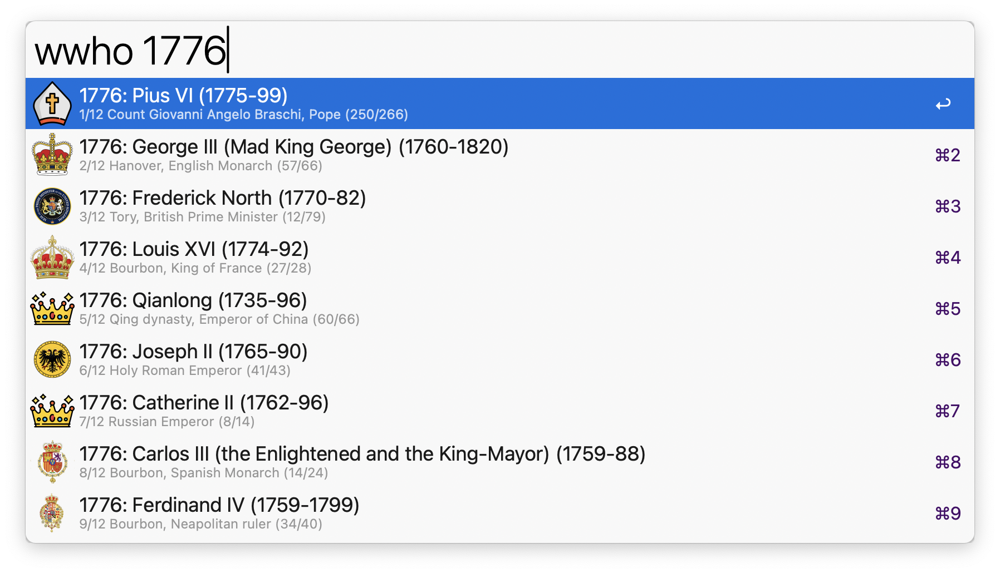

# alfred-WhoWasWhen 👑

Travel through history with Alfred

# Motivation

- to answer questions like:
  - "who was [king/president/emperor] in [year]?"
  - "when was [SoAndSo] [consul/prime minister]?"
  - quickly get to basic facts about a historical figure or event
  - search across 2877 Roman Consuls, 267 Popes, 1000+ monarchs, and 1000+ events

# Installation

1. Import this workflow into Alfred (double-click the .alfredworkflow file)
2. Use the keyword `wwho-go` (or set your own in `Workflow Configuration`) to start a search.
   Optional: set a hotkey for faster access.

# Usage

Query search term can be:

1. 📆 a number (which will be interpreted as a year and will search for that year). Asterisks can be used as wildcards, e.g. `177*` will match any year starting with 177 (e.g. 1776, 1777, etc.).
   - Note: use a negative number to search for years before Christ, e.g. `-44` will search for 44 BC.
2. 📍 a number and a string (will search for the string in that year, for example `1789 france`, or `1323 pope`).
   - Note: wilcards can be combined with text searches, e.g. if you wonder who were the Popes in the 1500s, you can search `15** pope`.
3. 🫅 a string only (will search for a matching ruler, e.g. `catherine`)
4. an event (will search for a matching event, e.g. `french revolution`), if the checkbox "Show Events?" is enabled in `Workflow Configuration`.

Once a result is identified, it can be actioned in one of five ways:

1. ↩️ `Enter` will show the Wikipedia page of the ruler or event, if available
2. ^️️↩️ `ctrl+enter` will 'travel' to the first year of the ruling period or event
3. ⌘↩️ `cmd+enter` will 'travel' to the last year of the ruling period or event
4. ⌥↩️ `opt+enter` will show the list of rulers with that title (e.g. 'English monarch')
5. ⇧↩️ `shift+enter` will copy the info about the ruler or event to the clipboard

# Roadmap

- add other notable figures (artists etc)
- remotely update the database using a google sheet

# Known issues

- the seals/crown images may be historically inaccurate
- there might be other inaccuracies as well (e.g. duplicate consuls etc.). Please feel free to report them on GitHub!

# Troubleshooting

- If you encounter issues with the workflow, feel free to open an issue on the [GitHub repository](https://github.com/giovannicoppola/alfred-WhoWasWhen) or to email the Alfred Forum.

# Acknowledgments

- https://www.flaticon.com/free-icon/event_780575
- ChatGPT for the icon design
- [Cursor AI](https://cursor.com/) for help with the code and this README
