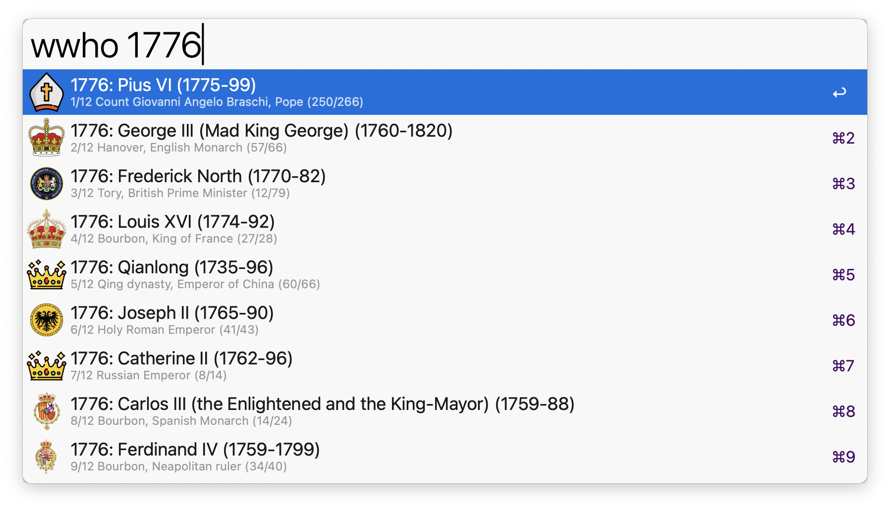

# alfred-WhoWasWhen 👑

Travel through history with Alfred

<a href="https://github.com/giovannicoppola/alfred-whowaswhen/releases/latest/">
 
</a>
<a href="https://alfred.app/workflows/giovannicoppola/whowaswhen/">
 
</a>

# Motivation

- to answer questions like:
  - "who was [king/president/emperor] in [year]?"
  - "when was [SoAndSo] [consul/prime minister]?"
  - quickly get to basic facts about a historical figure or event
  - search across 2877 Roman Consuls, 267 Popes, 1000+ monarchs, and 1000+ events

# Installation

1. Import this workflow into Alfred (double-click the .alfredworkflow file)
2. Use the keyword `wwho` (or set your own in `Workflow Configuration`) to start a search.

   _Optional_: set a hotkey for faster access.

# Usage

Query search term can be:

1. 📆 a number (which will be interpreted as a year and will search for that year). Asterisks can be used as wildcards, e.g. `177*` will match any year starting with 177 (e.g. 1776, 1777, etc.).
   - Note: use a negative number to search for years before Christ, e.g. `-44` will search for 44 BC.
2. 📍 a number and a string (will search for the string in that year, for example `1789 france`, or `1323 pope`).
   - Note: wilcards can be combined with text searches, e.g. if you wonder who were the Popes in the 1500s, you can search `15** pope`.
3. 🫅 a string only (will search for a matching ruler, e.g. `catherine`)
4. an event (will search for a matching event, e.g. `french revolution`), if the checkbox "Show Events?" is enabled in `Workflow Configuration`, or the search flag `--e` is used. If both rulers and events are returned, the `--e` search flag (e.g. entering "1939 --e" will restrict the output to events only

Once a result is identified, it can be actioned in one of five ways:

1. ↩️ `Enter` will show the Wikipedia page of the ruler or event, if available
2. ^️️↩️ `ctrl+enter` will 'travel' to the first year of the ruling period or event
3. ⌘↩️ `cmd+enter` will 'travel' to the last year of the ruling period or event
4. ⌥↩️ `opt+enter` will show the list of rulers with that title (e.g. 'English monarch')
5. ⇧↩️ `shift+enter` will copy the info about the ruler or event to the clipboard

   _Note_: ⌘⌥↩️ `cmd+option+enter` will return to the main search

# Workflow configuration

- Keyword to trigger the workflow (default: `wwho`)
- _Optional_: set a hotkey for faster access
- Show events? Include events in the results. If unchecked, events will be shown only if the `--e` search flag is used
- Refresh rate (in days): Frequency at which WhoWasWhen checks for changes in the master database. Set to 0 to never update. Default: 30 days
- Keyword to force a database refresh (default: `::whoWasWhen-refresh`)

# iPhone companion app 👑📱

WhoWasWhen also has a free iPhone companion app — the same history in your pocket when you're away from your Mac. It shares the same data and answers as the workflow, and works fully **offline** with **no account and no tracking**.

Beyond the workflow's search, the app adds:

- **Portraits & summaries** — Wikipedia portraits and a summary paragraph appear right in the app when you're online.
- **Lineages & timelines** — see everyone who held a title as a list or a scrollable visual timeline, with the one you tapped highlighted 🌟.
- **On this day & Discover** — a featured event from today's date, plus what happened 100, 200, 300… years ago.
- **Quiz** — endless multiple-choice trivia generated from the data (*Who was Pope in 1500? Who painted the Mona Lisa?*).
- **Favorites** — save results to revisit later.

# Roadmap

- learn mode
- per-person portraits (like the iPhone app)
- ... suggestions welcome!

# Known issues

- the seals/crown images may be historically inaccurate
- there might be other inaccuracies as well (e.g. duplicate consuls etc.). Please feel free to report them on GitHub!

# Troubleshooting

- If you encounter issues with the workflow, feel free to open an issue on the [GitHub repository](https://github.com/giovannicoppola/alfred-WhoWasWhen) or to email the Alfred Forum.

# Changelog

- 2026-07-08 version 0.4: accent- and case-insensitive search; person results now show ages; refresh rate now a slider in Workflow Configuration; [iPhone companion app](https://apps.apple.com/app/whowaswhen/id6780277187).
- 2025-07-19 version 0.3: minor changes preparing for Gallery submission
- 2025-07-10 version 0.2: added auto-refresh, `--e` flag
- 2025-07-07 version 0.1.1: database update
- 2025-07-04 first release (version 0.1)

# Acknowledgments

- https://www.flaticon.com/free-icon/event_780575
- icon design: ChatGPT
- [Cursor AI](https://cursor.com/) for help with the code and this README
