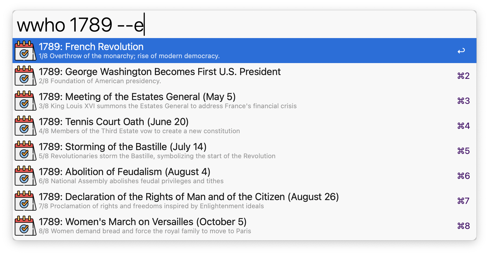
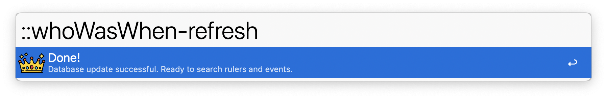

## Usage

Search for years, names, titles, or combinations via the `wwho` keyword.

Filter for events only via the `--e` search flag.

Once a result is identified, it can be actioned in one of five ways:

1. <kbd>↩</kbd> show the Wikipedia page of the ruler (or event, if available).
2. <kbd>^</kbd>️️<kbd>↩</kbd> 'travel' to the first year of the ruling period or event.
3. <kbd>⌘</kbd><kbd>↩</kbd> 'travel' to the last year of the ruling period or event.
4. <kbd>⌥</kbd><kbd>↩</kbd> show the list of rulers with that title (e.g. 'English monarch').
5. <kbd>⇧</kbd><kbd>↩</kbd> copy the info about the ruler or event to the clipboard.

_Note_: <kbd>⌘</kbd><kbd>⌥</kbd><kbd>↩</kbd> return to the main search.

## Update

Refresh the master database at intervals set in the Workflow's configuration, or manually via the `::whoWasWhen-refresh` keyword.

